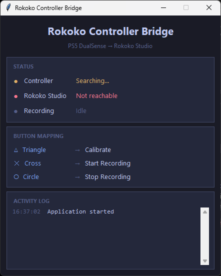

# Rokoko Controller Bridge

Maps PlayStation controller buttons to Rokoko Studio actions during motion capture sessions.



## Setup

**Requirements:** Python 3, a PlayStation controller (USB or Bluetooth), and Rokoko Studio with the Command API enabled.

Install dependencies:

```
pip install pygame
```

## Usage

**GUI app:**

```
python app.py
```

**Headless (CLI only):**

```
python controller_bridge.py
```

| Button | Action |
|---|---|
| **Triangle** | Rokoko calibration (3-second countdown) |
| **Cross (X)** | Start Rokoko recording |
| **Circle** | Stop Rokoko recording |

All presses are debounced with a 5-second cooldown to prevent accidental double-triggers.

## Configuration

These constants at the top of `controller_bridge.py` can be adjusted:

| Constant | Default | Description |
|---|---|---|
| `ROKOKO_API_KEY` | `"1234"` | Rokoko Studio Command API key |
| `CALIBRATE_BUTTON` | `3` (Triangle) | Button for Rokoko calibration |
| `RECORD_BUTTON` | `0` (Cross) | Button to start recording |
| `STOP_BUTTON` | `1` (Circle) | Button to stop recording |
| `DEBOUNCE_SECONDS` | `5` | Cooldown between accepted presses |

If buttons aren't mapping correctly, press them while the script is running — pygame will report the button index, which you can use to update the constants.

## iClone Mode

Set `ICLONE_ENABLED = True` in `controller_bridge.py` to also trigger iClone's Motion LIVE Record button via screen automation. This requires additional dependencies:

```
pip install pyautogui opencv-python
```

## Building

A GitHub Actions workflow (`.github/workflows/build.yml`) builds a standalone Windows `.exe` via PyInstaller. Trigger it by pushing a `v*` tag or running it manually.
